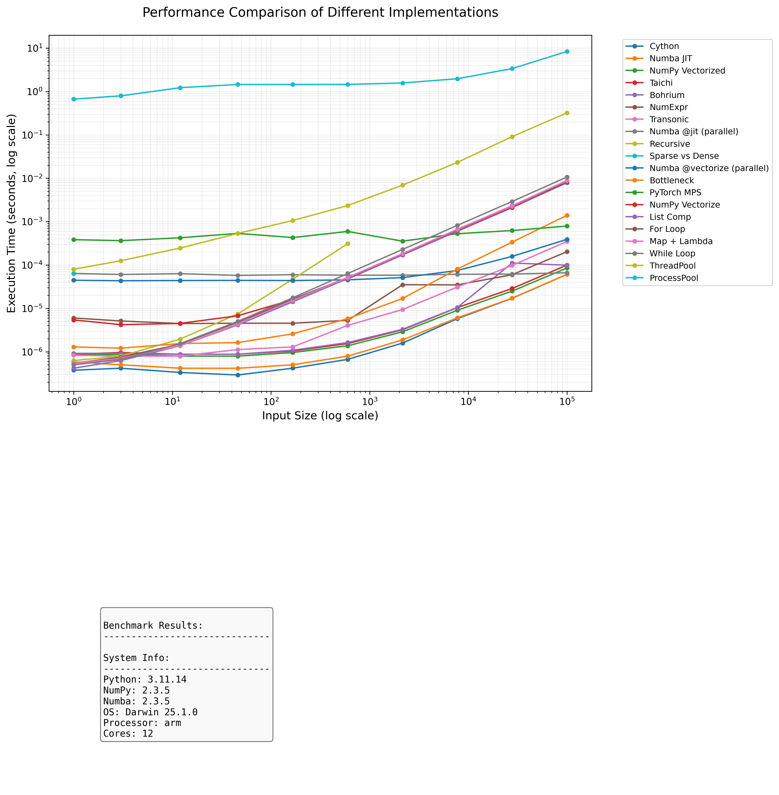

# Python Speed Benchmark

A comprehensive benchmark comparing different Python implementations of a simple mathematical operation `(x + 12) // 7` across various input sizes and parallelization techniques.

## Installation

1. Clone the repository:
   ```bash
   cd python_speed
   ```

2. Create and activate a virtual environment (recommended):
   ```bash
   python3 -m venv venv
   source venv/bin/activate  # On Windows: venv\Scripts\activate
   ```

3. Install dependencies:
   ```bash
   pip install -r requirements.txt
   ```

4. Build the Cython extension:
   ```bash
   python setup.py build_ext --inplace
   ```

## Implementations

The project includes the following implementations:

### Basic Python
- For Loop
- List Comprehension
- While Loop
- Map + Lambda
- Recursive (limited to small inputs)

### Optimized
- NumPy Vectorized
- NumPy Vectorize (wrapper)
- Numba JIT
- Cython

### Parallel
- ThreadPool
- ProcessPool

### GPU (if available)
- CUDA (via Numba)
- PyTorch MPS (Apple Silicon)

## Usage

### Running Benchmarks

Run the main benchmark:
```bash
python main.py
```

### Generating Performance Plots

To generate performance plots, you can either:

1. Run the benchmark and generate plots in one command:
   ```bash
   python benchmark_plot.py
   ```

2. Or use the provided `run.sh` script which will:
   - Build the Cython extensions
   - Run the benchmark plot generation
   
   ```bash
   chmod +x run.sh  # Make the script executable if needed
   ./run.sh
   ```

   The `run.sh` script is particularly useful as it ensures the Cython code is properly compiled before running the benchmarks.

## Benchmark Results



## Performance Analysis

Key observations from the benchmark:

1. **Vectorized Operations**: NumPy and Numba show the best performance for large datasets due to their vectorized operations and JIT compilation.

2. **Parallel Processing**: 
   - ThreadPool is effective for I/O-bound tasks but less so for CPU-bound tasks due to Python's GIL.
   - ProcessPool can leverage multiple CPU cores but has higher overhead.

3. **GPU Acceleration**:
   - CUDA provides significant speedup for very large datasets.
   - PyTorch MPS on Apple Silicon shows excellent performance for medium to large datasets.

4. **Python Loops**:
   - Native Python loops are significantly slower than vectorized operations.
   - List comprehensions are generally faster than explicit for loops.

## Contributing

Contributions are welcome! Please feel free to submit a Pull Request.

## License

[MIT License](LICENSE)
